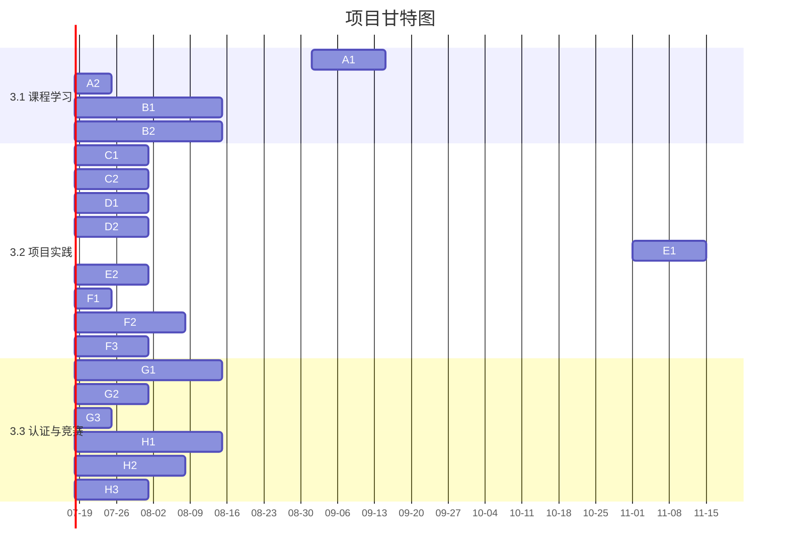

```mermaid
gantt
    title 项目甘特图
    dateFormat YYYY-MM-DD
    axisFormat %m-%d

    section 3.1 课程学习
    A1: 3.1.1.1, 2026-09-01, 2w
    A2: 3.1.1.2, after A1, 1w
    B1: 3.1.2.1, after A1, 4w
    B2: 3.1.2.2, after B1, 4w

    section 3.2 项目实践
    C1: 3.2.1.1, after B2, 2w
    C2: 3.2.1.2, after C1, 2w
    D1: 3.2.2.1, after C2, 2w
    D2: 3.2.2.2, after D1, 2w
    E1: 3.2.3.1, 2026-11-01, 2w
    E2: 3.2.3.2, after C2, 2w
    F1: 3.2.4.1, after E2, 1w
    F2: 3.2.4.2, after F1, 3w
    F3: 3.2.4.3, after F2, 2w

    section 3.3 认证与竞赛
    G1: 3.3.1.1, after F3, 4w
    G2: 3.3.1.2, after G1, 2w
    G3: 3.3.1.3, after G2, 1w
    H1: 3.3.2.1, after F3, 4w
    H2: 3.3.2.2, after H1, 3w
    H3: 3.3.2.3, after H2, 2w

    

```